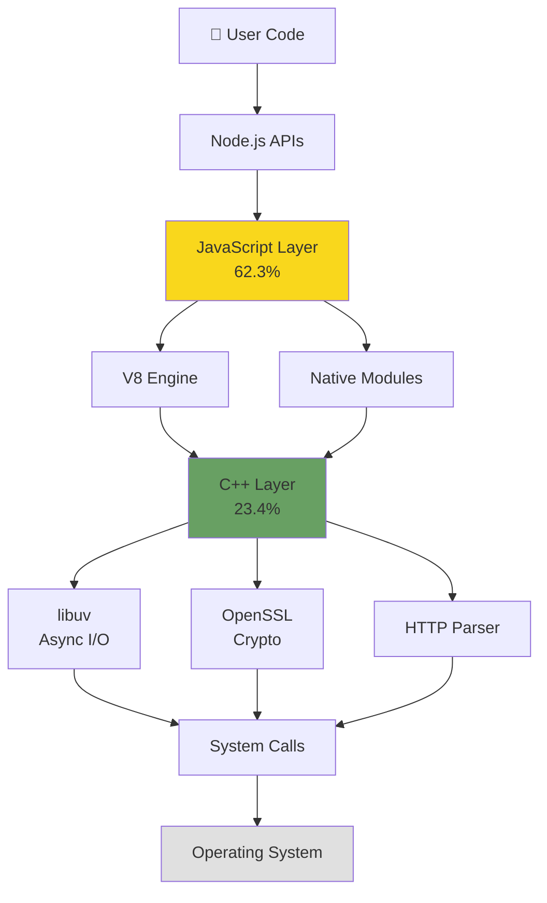

# Node.js Architecture Overview

## Components

- **JavaScript Layer** (62.3%) - User-facing APIs and Node.js core modules
- **V8 Engine** - Google's JavaScript execution engine
- **C++ Layer** (23.4%) - Core implementation and native bindings
- **libuv** - Cross-platform asynchronous I/O library
- **System Integration** - Direct OS access for networking, file I/O, and timers

## Language Composition

- JavaScript: 62.3%
- C++: 23.4%
- Python: 10.1%
- C: 2.6%
- Other: 1.0%